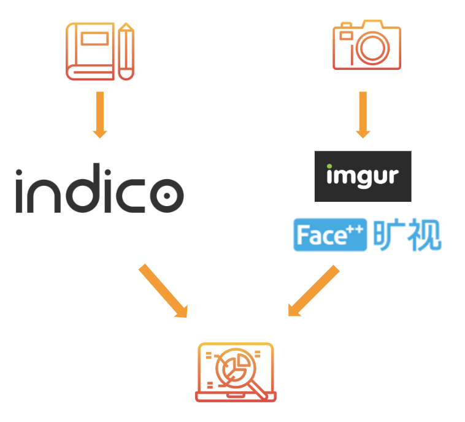
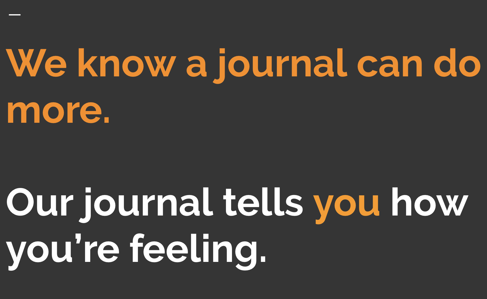

# [MooooD](rhcmoore.github.io/Project1/)

[The Journal that Writes Back](https://rhcmoore.github.io/Project1/). 

<!-- Your browser does not support the video tag. -->

## Getting Started 
Write to your journal about your day, and include a representative image of your face. After you submit your entry, view a sentiment analysis of your text and an emotional analysis of your facial emotions. How are you feeling today?

Continue and see a running history of your journal entries. How have your emotions changed over time? 

## About

We set out to create a better journal. Combined with the positive effects of journalling, we believe an analysis of our emotions could help us better understand ourselves and contextualize the world around us.

MoooooD takes advantage of the API services of [Indico](https://indico.io/), [Face++](https://www.faceplusplus.com/), and [Imgur](https://api.imgur.com/) to provide a unique look at your everyday emotions.

The web application takes advantage of the Authentication, Database, and Storage functionality of Firebase to maintain user profiles with persistent journal logs, photos, and analysis results.

## Authors
Ryan Moore - [github.com/rhcmoore](https://github.com/rhcmoore)

Maja Morales - [github.com/ajam2617](https://github.com/ajam2617)

Charles Gedeon - [github.com/OCGedeon](https://github.com/OCGedeon)

Michael Wu - [github.com/wufasa](https://github.com/wufasa)

## License
This project is licensed under the MIT License - see the LICENSE.md file for details.

